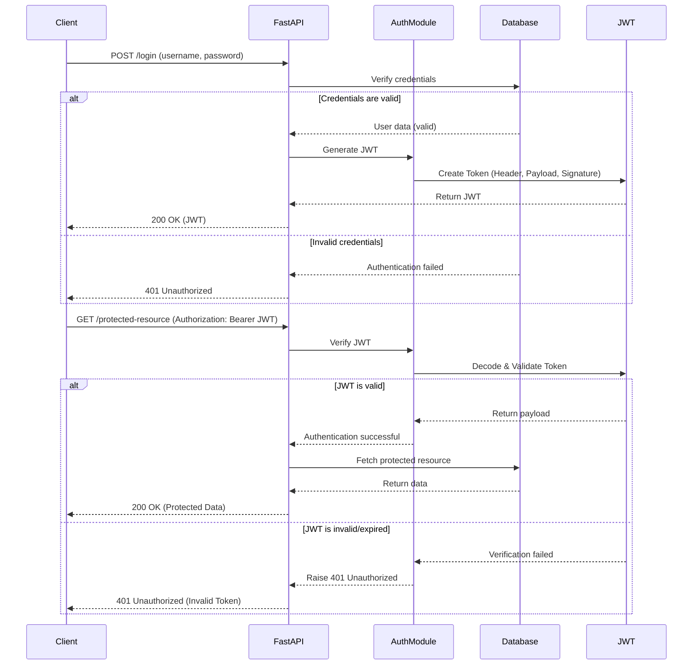
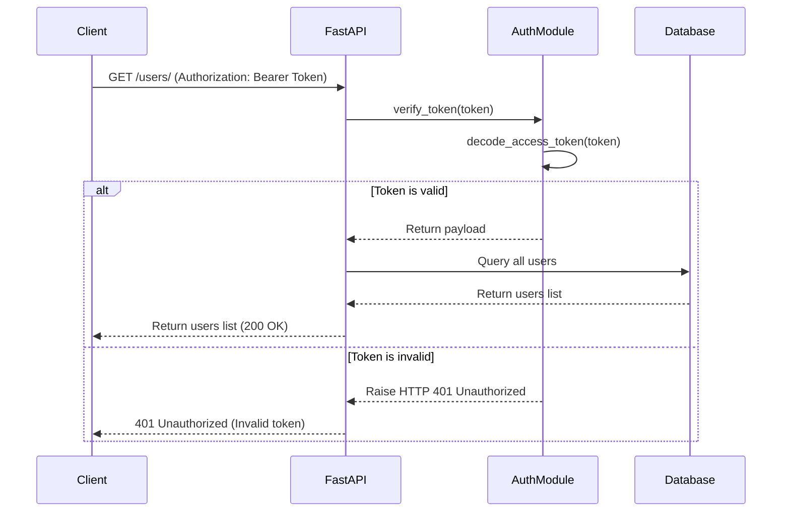

# Dev Memo

## fastapi dev main.py と uvicorn main:app の違い

### fastapi dev main.py

これは **FastAPI の公式 CLI コマンド** を使用して開発サーバーを起動する方法です。  
`fastapi` CLI（FastAPI の公式ツール）には、`dev` というコマンドがあり、開発環境向けに `uvicorn` をラップして提供します。

特徴:

- `--reload`（ホットリロード）がデフォルトで有効
- 設定の管理が簡単（`.env` ファイルを自動で読み込む）
- `pyproject.toml` に設定を記述できる
- 簡単なコマンドで実行可能

使い方:

```sh
fastapi dev main.py
```

### uvicorn main:app

これは **Uvicorn（ASGI サーバー）を直接使う方法** です。  
`uvicorn` は FastAPI アプリケーションを ASGI サーバーとして実行するために使われます。

特徴:

- `--reload` をつけない限りホットリロードなし（デフォルトはプロダクション向け）
- より細かいオプション指定が可能（例: `--host` や `--port`）
- `gunicorn` との組み合わせで運用可能（`gunicorn -k uvicorn.workers.UvicornWorker`）

使い方:

```sh
uvicorn main:app --reload
```

## どちらを使うべきか

| コマンド | 主な用途 | 特徴 |
|----------|--------|------|
| `fastapi dev main.py` | 開発用 | 簡単、FastAPI 公式ツール、設定を `.env` や `pyproject.toml` から読み込める |
| `uvicorn main:app --reload` | 開発用 | 公式 CLI なしでも利用可能、オプションを細かく設定可能 |
| `uvicorn main:app` | 本番環境 | 高速、安定した ASGI サーバーとして動作 |

開発では `fastapi dev` を使うと便利ですが、プロダクション環境では `uvicorn main:app` を使うのが一般的です。

## 認証

クライアントが `username` と `password` を送信すると、サーバーはデータベースで認証情報を検証する。認証が成功すれば、**JWT（Json Web Token）**を発行する。

サーバーは **HS256（HMAC SHA-256）アルゴリズム** を使用して、秘密鍵を用いてJWTを生成する。JWTには以下の3つの部分が含まれる：

- **Header**（アルゴリズムとトークンのタイプ）
- **Payload**（ユーザーIDやロールなどの情報）
- **Signature**（ヘッダーとペイロードを、秘密鍵を用いてHMAC SHA-256で署名したもの）

JWTの生成は以下の手順で行われる：

1. **HeaderとPayloadをBase64エンコード** し、それらを `.` で結合する。
2. **結合したデータを秘密鍵を使ってHMAC SHA-256で署名** し、Signatureを作成する。
3. **Header, Payload, Signatureを `.` で連結** して、JWTを完成させる。

生成されたJWTはクライアントに返され、クライアントはこれを `localStorage` や `HttpOnly Cookie` などに保存する。

その後、クライアントが保護されたリソースにアクセスする際、HTTPリクエストのヘッダーに `Authorization: Bearer <JWT>` を付与する。

サーバーはリクエストからJWTを取得し、以下の検証を行う：

- **署名の検証**（改竄されていないか）
  - 受け取ったJWTの **HeaderとPayloadを取得し、秘密鍵を使って再計算** したSignatureと照合する。
  - もしSignatureが異なれば、トークンが改ざんされたと判断し、無効とする。
- **期限切れかどうかのチェック**（`exp` クレームの確認）
  - Payload内の `exp`（有効期限）が現在の時刻より過去なら、トークンは期限切れと判断する。

JWTが有効ならば、ペイロード情報を取得し、リクエストを処理する。一方、無効または期限切れの場合、`401 Unauthorized` を返す。

### JWTの仕組み



例: 認証が必要なエンドポイント(`GET: /users`)にアクセスした時の処理の流れ


